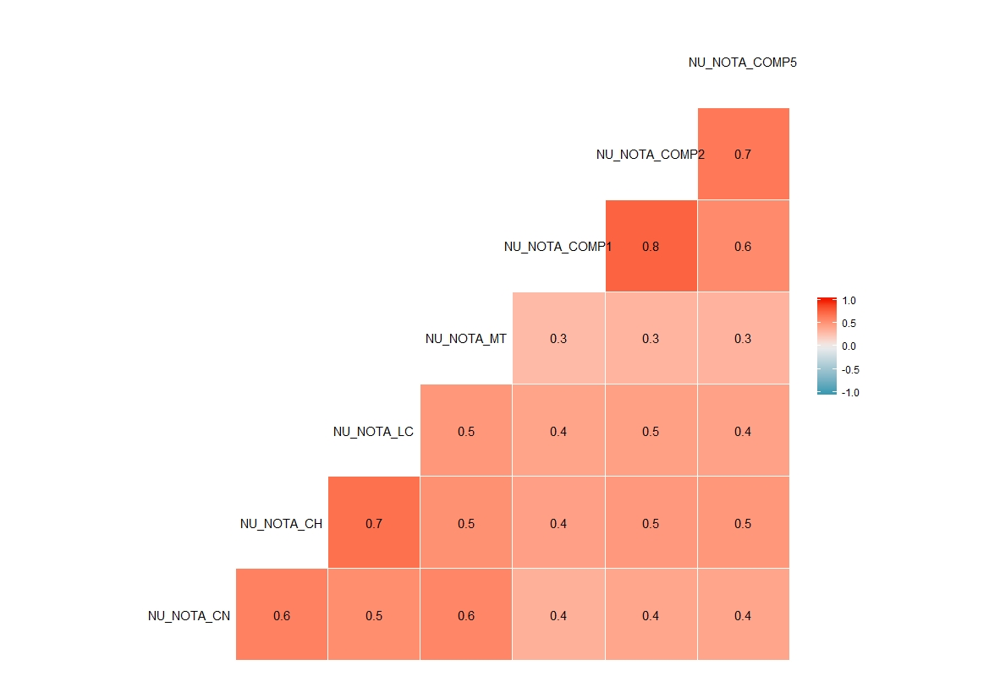
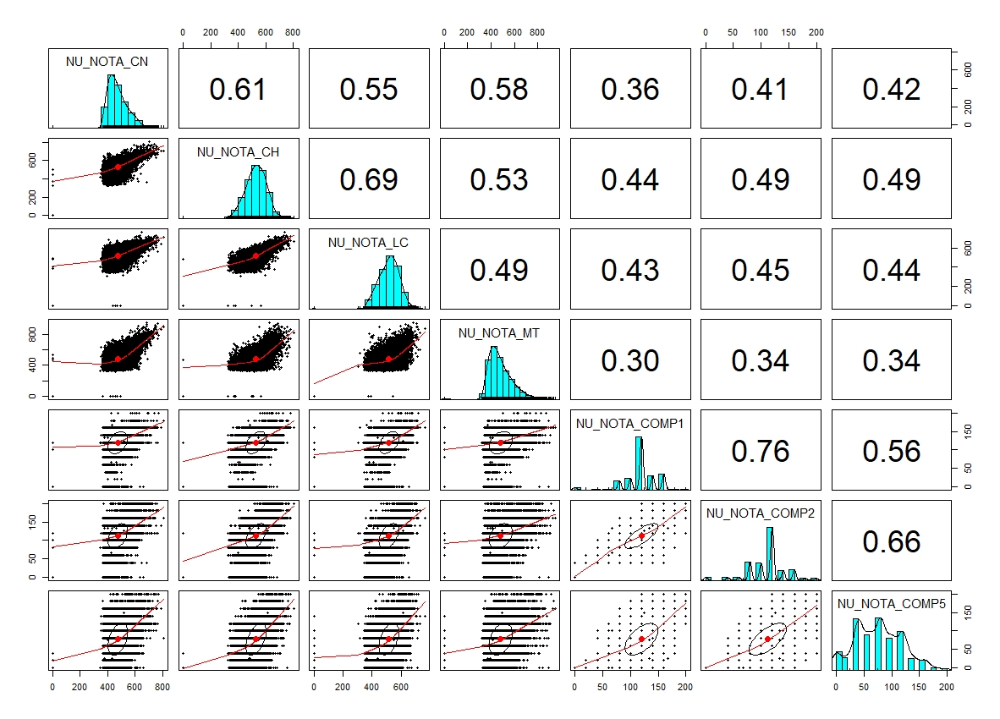
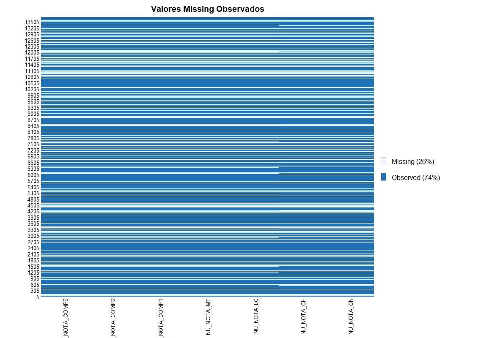
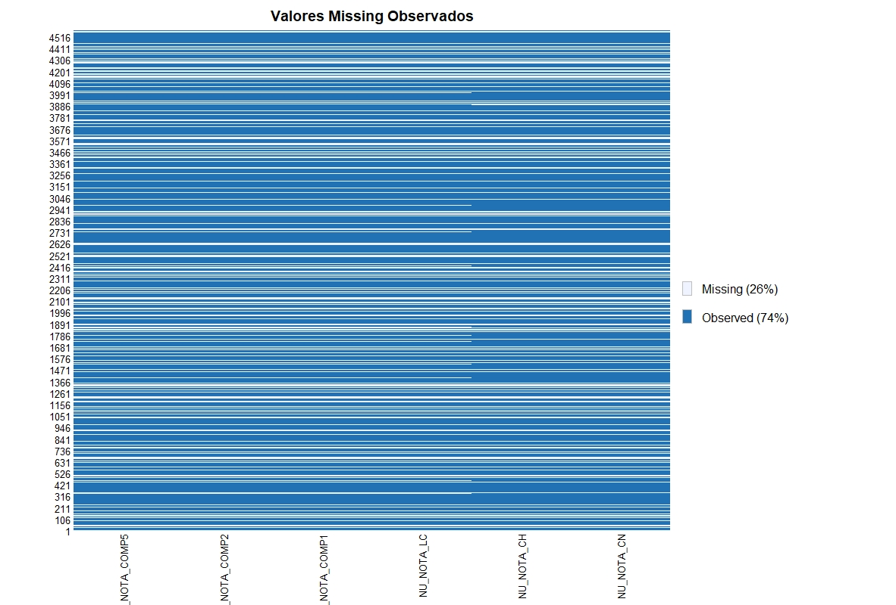
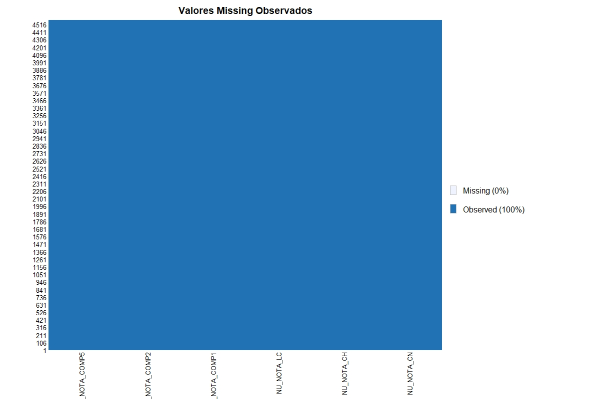

## Desafio em R

  O contexto do desafio gira em torno dos resultados do ENEM 2016 (disponíveis no arquivo train.csv) fornecidos pela Covenation, um dicionário de dados em EXCEL com as informações sobre cada feature e outro arquivo CSV utilizado para predição dos valores da variável target. 
  
  O projeto contava com uma base de dados de 167 variáveis e mais de 13 mil observações cujo objetivo final era a previsão da nota de matemática de um aluno, sendo que obrigatoriamente o algoritmo deveria ter uma eficácia maior que 90%.
Com isso, vamos ao que interessa:

```r
# Definindo a pasta de trabalho
setwd("~/codenation")
```
```r
# Carregando os pacotes 
library(Amelia)
library(ggplot2)
library(caret)
library(reshape)
library(randomForest)
library(dplyr)
library(e1071)
library(GGally)
library(psych)

# carregando CSV de treino
dados_treino <- read.csv("train.csv", sep = ",", encoding = "UTF-8")

# visualizando dados
View(dados_treino)
str(dados_treino)
```
```
## 'data.frame':    13730 obs. of  167 variables:
##  $ X                          : int  1 2 3 4 5 6 7 8 9 10 ...
##  $ NU_INSCRICAO               : Factor w/ 13730 levels "0003e4a7d68117b3585d3a0fc2b7cf3ca7ee0e8e",..: 12711 2450 13092 3356 10254 8732 5369 2550 4755 7975 ...
##  $ NU_ANO                     : int  2016 2016 2016 2016 2016 2016 2016 2016 2016 2016 ...
##  $ CO_MUNICIPIO_RESIDENCIA    : int  4314902 2304707 2304400 3304557 1302603 2902005 5102637 4301602 2601904 3152501 ...
##  $ NO_MUNICIPIO_RESIDENCIA    : Factor w/ 2632 levels "Abadia de Goiás",..: 1894 922 850 2014 1383 129 467 210 291 1917 ...
##  $ CO_UF_RESIDENCIA           : int  43 23 23 33 13 29 51 43 26 31 ...
##  $ SG_UF_RESIDENCIA           : Factor w/ 27 levels "AC","AL","AM",..: 23 6 6 19 3 5 13 23 16 11 ...
##  $ NU_IDADE                   : int  24 17 21 25 28 18 18 18 16 24 ...
##  $ TP_SEXO                    : Factor w/ 2 levels "F","M": 2 1 1 1 2 1 1 1 1 2 ...
##  $ TP_ESTADO_CIVIL            : int  0 0 0 0 0 0 0 0 0 0 ...
##  $ TP_COR_RACA                : int  1 3 3 0 2 1 3 1 3 4 ...
##  $ TP_NACIONALIDADE           : int  1 1 1 1 1 1 1 1 1 2 ...
##  $ CO_MUNICIPIO_NASCIMENTO    : int  4314902 2304707 2304400 3304557 1505304 2933307 2804508 3550308 2601904 NA ...
##  $ NO_MUNICIPIO_NASCIMENTO    : Factor w/ 2344 levels "","Abadia de Goiás",..: 1702 830 770 1799 1480 2328 1423 2050 270 1 ...
##  $ CO_UF_NASCIMENTO           : int  43 23 23 33 15 29 28 35 26 NA ...
##  $ SG_UF_NASCIMENTO           : Factor w/ 28 levels "","AC","AL","AM",..: 24 7 7 20 15 6 26 27 17 1 ...
##  $ TP_ST_CONCLUSAO            : int  1 2 3 1 1 1 2 1 2 4 ...
##  $ TP_ANO_CONCLUIU            : int  4 0 0 9 4 1 0 1 0 0 ...
##  $ TP_ESCOLA                  : int  1 2 1 1 1 1 2 1 2 1 ...
##  $ TP_ENSINO                  : int  NA 1 NA NA NA NA 1 NA 1 NA ...
##  $ IN_TREINEIRO               : int  0 0 0 0 0 0 0 0 0 0 ...
##  $ CO_ESCOLA                  : int  NA 23005157 NA NA NA NA 51010224 NA 26177013 NA ...
##  $ CO_MUNICIPIO_ESC           : int  NA 2304707 NA NA NA NA 5102637 NA 2601904 NA ...
##  $ NO_MUNICIPIO_ESC           : Factor w/ 1476 levels "","Abadia de Goiás",..: 1 523 1 1 1 1 277 1 178 1 ...
##  $ CO_UF_ESC                  : int  NA 23 NA NA NA NA 51 NA 26 NA ...
##  $ SG_UF_ESC                  : Factor w/ 28 levels "","AC","AL","AM",..: 1 7 1 1 1 1 14 1 17 1 ...
##  $ TP_DEPENDENCIA_ADM_ESC     : int  NA 2 NA NA NA NA 2 NA 2 NA ...
##  $ TP_LOCALIZACAO_ESC         : int  NA 1 NA NA NA NA 1 NA 1 NA ...
##  $ TP_SIT_FUNC_ESC            : int  NA 1 NA NA NA NA 1 NA 1 NA ...
##  $ IN_BAIXA_VISAO             : int  0 0 0 0 0 0 0 0 0 0 ...
##  $ IN_CEGUEIRA                : int  0 0 0 0 0 0 0 0 0 0 ...
##  $ IN_SURDEZ                  : int  0 0 0 0 0 0 0 0 0 0 ...
##  $ IN_DEFICIENCIA_AUDITIVA    : int  0 0 0 0 0 0 0 0 0 0 ...
##  $ IN_SURDO_CEGUEIRA          : int  0 0 0 0 0 0 0 0 0 0 ...
##  $ IN_DEFICIENCIA_FISICA      : int  0 0 0 0 0 0 0 0 0 0 ...
##  $ IN_DEFICIENCIA_MENTAL      : int  0 0 0 0 0 0 0 0 0 0 ...
##  $ IN_DEFICIT_ATENCAO         : int  0 0 0 0 0 0 0 0 0 0 ...
##  $ IN_DISLEXIA                : int  0 0 0 0 0 0 0 0 0 0 ...
##  $ IN_DISCALCULIA             : int  0 0 0 0 0 0 0 0 0 0 ...
##  $ IN_AUTISMO                 : int  0 0 0 0 0 0 0 0 0 0 ...
##  $ IN_VISAO_MONOCULAR         : int  0 0 0 0 0 0 0 0 0 0 ...
##  $ IN_OUTRA_DEF               : int  0 0 0 0 0 0 0 0 0 0 ...
##  $ IN_SABATISTA               : int  0 0 0 0 0 0 0 0 0 0 ...
##  $ IN_GESTANTE                : int  0 0 0 0 0 0 0 0 0 0 ...
##  $ IN_LACTANTE                : int  0 0 0 0 0 0 0 0 0 0 ...
##  $ IN_IDOSO                   : int  0 0 0 0 0 0 0 0 0 0 ...
##  $ IN_ESTUDA_CLASSE_HOSPITALAR: int  0 0 0 0 0 0 0 0 0 0 ...
##  $ IN_SEM_RECURSO             : int  0 0 0 0 0 0 0 0 0 0 ...
##  $ IN_BRAILLE                 : int  0 0 0 0 0 0 0 0 0 0 ...
##  $ IN_AMPLIADA_24             : int  0 0 0 0 0 0 0 0 0 0 ...
##  $ IN_AMPLIADA_18             : int  0 0 0 0 0 0 0 0 0 0 ...
##  $ IN_LEDOR                   : int  0 0 0 0 0 0 0 0 0 0 ...
##  $ IN_ACESSO                  : int  0 0 0 0 0 0 0 0 0 0 ...
##  $ IN_TRANSCRICAO             : int  0 0 0 0 0 0 0 0 0 0 ...
##  $ IN_LIBRAS                  : int  0 0 0 0 0 0 0 0 0 0 ...
##  $ IN_LEITURA_LABIAL          : int  0 0 0 0 0 0 0 0 0 0 ...
##  $ IN_MESA_CADEIRA_RODAS      : int  0 0 0 0 0 0 0 0 0 0 ...
##  $ IN_MESA_CADEIRA_SEPARADA   : int  0 0 0 0 0 0 0 0 0 0 ...
##  $ IN_APOIO_PERNA             : int  0 0 0 0 0 0 0 0 0 0 ...
##  $ IN_GUIA_INTERPRETE         : int  0 0 0 0 0 0 0 0 0 0 ...
##  $ IN_MACA                    : int  0 0 0 0 0 0 0 0 0 0 ...
##  $ IN_COMPUTADOR              : int  0 0 0 0 0 0 0 0 0 0 ...
##  $ IN_CADEIRA_ESPECIAL        : int  0 0 0 0 0 0 0 0 0 0 ...
##  $ IN_CADEIRA_CANHOTO         : int  0 0 0 0 0 0 0 0 0 0 ...
##  $ IN_CADEIRA_ACOLCHOADA      : int  0 0 0 0 0 0 0 0 0 0 ...
##  $ IN_PROVA_DEITADO           : int  0 0 0 0 0 0 0 0 0 0 ...
##  $ IN_MOBILIARIO_OBESO        : int  0 0 0 0 0 0 0 0 0 0 ...
##  $ IN_LAMINA_OVERLAY          : int  0 0 0 0 0 0 0 0 0 0 ...
##  $ IN_PROTETOR_AURICULAR      : int  0 0 0 0 0 0 0 0 0 0 ...
##  $ IN_MEDIDOR_GLICOSE         : int  0 0 0 0 0 0 0 0 0 0 ...
##  $ IN_MAQUINA_BRAILE          : int  0 0 0 0 0 0 0 0 0 0 ...
##  $ IN_SOROBAN                 : int  0 0 0 0 0 0 0 0 0 0 ...
##  $ IN_MARCA_PASSO             : int  0 0 0 0 0 0 0 0 0 0 ...
##  $ IN_SONDA                   : int  0 0 0 0 0 0 0 0 0 0 ...
##  $ IN_MEDICAMENTOS            : int  0 0 0 0 0 0 0 0 0 0 ...
##  $ IN_SALA_INDIVIDUAL         : int  0 0 0 0 0 0 0 0 0 0 ...
##  $ IN_SALA_ESPECIAL           : int  0 0 0 0 0 0 0 0 0 0 ...
##  $ IN_SALA_ACOMPANHANTE       : int  0 0 0 0 0 0 0 0 0 0 ...
##  $ IN_MOBILIARIO_ESPECIFICO   : int  0 0 0 0 0 0 0 0 0 0 ...
##  $ IN_MATERIAL_ESPECIFICO     : int  0 0 0 0 0 0 0 0 0 0 ...
##  $ IN_NOME_SOCIAL             : int  0 0 0 0 0 0 0 0 0 0 ...
##  $ IN_CERTIFICADO             : int  0 0 0 0 0 0 0 0 0 1 ...
##  $ NO_ENTIDADE_CERTIFICACAO   : Factor w/ 62 levels "","INSTITUTO FEDERAL DE EDUCAÇÃO CIÊNCIA E TECNOLOGIA BAIANO",..: 1 1 1 1 1 1 1 1 1 30 ...
##  $ CO_UF_ENTIDADE_CERTIFICACAO: int  NA NA NA NA NA NA NA NA NA 31 ...
##  $ SG_UF_ENTIDADE_CERTIFICACAO: Factor w/ 28 levels "","AC","AL","AM",..: 1 1 1 1 1 1 1 1 1 12 ...
##  $ CO_MUNICIPIO_PROVA         : int  4314902 2304707 2304400 3304557 1302603 2904605 5102637 3550308 2601904 3152501 ...
##  $ NO_MUNICIPIO_PROVA         : Factor w/ 1489 levels "Abaeté","Abaetetuba",..: 1082 525 498 1144 793 227 287 1303 189 1094 ...
##  $ CO_UF_PROVA                : int  43 23 23 33 13 29 51 35 26 31 ...
##  $ SG_UF_PROVA                : Factor w/ 27 levels "AC","AL","AM",..: 23 6 6 19 3 5 13 26 16 11 ...
##  $ TP_PRESENCA_CN             : int  1 1 0 0 0 1 1 1 1 0 ...
##  $ TP_PRESENCA_CH             : int  1 1 0 0 0 1 1 1 1 0 ...
##  $ TP_PRESENCA_LC             : int  1 1 0 0 0 1 1 1 1 0 ...
##  $ TP_PRESENCA_MT             : int  1 1 0 0 0 1 1 1 1 0 ...
##  $ CO_PROVA_CN                : Factor w/ 10 levels "03b1fba5c1ebbc47988cd303b08982cfb2aa9cf2",..: 2 8 4 4 4 9 5 8 8 4 ...
##  $ CO_PROVA_CH                : Factor w/ 10 levels "0fb4772fc6ee9b951ade2fbe6699cc37985c422e",..: 6 4 2 2 2 9 5 4 4 2 ...
##  $ CO_PROVA_LC                : Factor w/ 9 levels "01abbb7f1a90505385f44eec9905f82ca2a42cfd",..: 2 2 3 3 3 1 6 7 6 3 ...
##  $ CO_PROVA_MT                : Factor w/ 9 levels "0e0082361eaceb6418bb17305a2b7912650b4783",..: 9 9 3 3 3 8 7 4 7 3 ...
##  $ NU_NOTA_CN                 : num  436 474 NA NA NA ...
##  $ NU_NOTA_CH                 : num  495 544 NA NA NA ...
##   [list output truncated]

```
  Após o estudo do dicionário de dados de dados concedido, acredito particularmente que algumas variáveis devem ter maior correlação com a variável TARGET "NU_NOTA_MT", porém é necessário verificar seus índices para a constatação, portanto:
```r
# Feature selection
cols <- c("NU_NOTA_CN",
          "NU_NOTA_CH",
          "NU_NOTA_LC",
          "NU_NOTA_MT",
          "NU_NOTA_COMP1",
          "NU_NOTA_COMP2",
          "NU_NOTA_COMP5"
)

dados_treino_nm <-subset(dados_treino, select = cols)
```
```r
#Relação entre as variáveis escolhidas 
ggcorr(dados_treino_nm[, cols], label=T)
pairs.panels(dados_treino_nm[, cols])
```



```r
# Verificação dos valores NA
sapply(dados_treino_nm, function(x) sum(is.na(x)))

##    NU_NOTA_CN    NU_NOTA_CH    NU_NOTA_LC    NU_NOTA_MT NU_NOTA_COMP1 
##          3389          3389          3597          3597          3597 
## NU_NOTA_COMP2 NU_NOTA_COMP5 
##          3597          3597

missmap(dados_treino_nm, main = "Valores Missing Observados")
```


Há algumas formas diferentes de tratar valores tidos como NA, tais como:
- Atribuir a média da coluna como valor NA à variável correspondente
- Descartar as linhas NA do dataset
- Atribuir valor 0 aos valores NA

Após alguns testes, devido ao modelo de regressão adotado, pude constatar um melhor resultado assumindo a terceira opção descrita acima.
```r
#alterando valores NA para 0 
dados_treino_nm[is.na(dados_treino_nm)] <- 0
missmap(dados_treino_nm, main = "Valores Missing Observados")
```


```r
#gerando CSV de treino
write.csv(dados_treino_nm, "dados_treino_nm.csv", sep = ";", dec = ",",row.names = FALSE)
```

##          Criação do Modelo de Regressão Linear - Treino               

  Neste projeto utilizei 2 modelos de machine learning para a predição e testei os resultados, o que já me pareceu satisfatório com o Random Forest atingindo 91,5% de acurácia.

```r
#1° modelo usando regressao linear simples
model <- lm(NU_NOTA_MT ~ ., 
            data = dados_treino_nm)

summary(model)

## Call:
## lm(formula = NU_NOTA_MT ~ ., data = dados_treino_nm)
## 
## Residuals:
##     Min      1Q  Median      3Q     Max 
## -482.83  -42.22    2.85   29.78  438.63 
## 
## Coefficients:
##                Estimate Std. Error t value Pr(>|t|)    
## (Intercept)   -2.849345   1.203625  -2.367 0.017932 *  
## NU_NOTA_CN     0.351414   0.011811  29.753  < 2e-16 ***
## NU_NOTA_CH    -0.126892   0.011684 -10.861  < 2e-16 ***
## NU_NOTA_LC     0.666019   0.009035  73.717  < 2e-16 ***
## NU_NOTA_COMP1  0.134567   0.036372   3.700 0.000217 ***
## NU_NOTA_COMP2  0.142051   0.035933   3.953 7.75e-05 ***
## NU_NOTA_COMP5  0.118110   0.021710   5.440 5.41e-08 ***
## ---
## Signif. codes:  0 '***' 0.001 '**' 0.01 '*' 0.05 '.' 0.1 ' ' 1
## 
## Residual standard error: 71.43 on 13723 degrees of freedom
## Multiple R-squared:  0.9026, Adjusted R-squared:  0.9026 
## F-statistic: 2.12e+04 on 6 and 13723 DF,  p-value: < 2.2e-16
```
```r
#2° modelo usando Random Forest
model2 <- randomForest(NU_NOTA_MT ~ ., 
                       data = dados_treino_nm)

model2

## Call:
##  randomForest(formula = NU_NOTA_MT ~ ., data = dados_treino_nm) 
##                Type of random forest: regression
##                      Number of trees: 500
## No. of variables tried at each split: 2
## 
##           Mean of squared residuals: 4370.723
##                     % Var explained: 91.65
```
```r
# Salvando o modelo
saveRDS(model2, file = "lm_model.rds")

# Carregando o modelo
modelo <- readRDS("lm_model.rds")
```

## Carregando o Dataset de Teste para Predição 

```r
# carregando CSV de teste
dados_teste <- read.csv("test.csv", sep = ",", encoding = "UTF-8")

# visualizando dados
View(dados_teste)
summary(dados_teste)

##                                    NU_INSCRICAO  CO_UF_RESIDENCIA
##  0002c409e1ee2353dbff680d9a7e77a5f0b50a94:   1   Min.   :11.00   
##  000d12a79ec47849650d1b3253771ceac2386a24:   1   1st Qu.:23.00   
##  000d2fb8cf3442ad7b4623982f69625ed0ca34ee:   1   Median :31.00   
##  0013741ec1dc7e4c3b5baf73f61a47d7585292d9:   1   Mean   :30.76   
##  0027244961763bce90296b05ab1c58b25feecbea:   1   3rd Qu.:35.00   
##  0031a184b641879da21aa6b20afe7fe981cbd0b9:   1   Max.   :53.00   
##  (Other)                                 :4570                   
##  SG_UF_RESIDENCIA    NU_IDADE     TP_SEXO   TP_COR_RACA    TP_NACIONALIDADE
##  SP     : 698     Min.   :14.00   F:2768   Min.   :0.000   Min.   :0.000   
##  CE     : 588     1st Qu.:17.00   M:1808   1st Qu.:1.000   1st Qu.:1.000   
##  MG     : 446     Median :19.00            Median :3.000   Median :1.000   
##  BA     : 309     Mean   :21.54            Mean   :2.181   Mean   :1.061   
##  RJ     : 256     3rd Qu.:23.00            3rd Qu.:3.000   3rd Qu.:1.000   
##  PR     : 234     Max.   :65.00            Max.   :5.000   Max.   :4.000   
##  (Other):2045                                                              
##  TP_ST_CONCLUSAO TP_ANO_CONCLUIU   TP_ESCOLA       TP_ENSINO    
##  Min.   :1.000   Min.   : 0.00   Min.   :1.000   Min.   :1.000  
##  1st Qu.:1.000   1st Qu.: 0.00   1st Qu.:1.000   1st Qu.:1.000  
##  Median :2.000   Median : 0.00   Median :1.000   Median :1.000  
##  Mean   :1.791   Mean   : 2.12   Mean   :1.369   Mean   :1.182  
##  3rd Qu.:2.000   3rd Qu.: 3.00   3rd Qu.:2.000   3rd Qu.:1.000  
##  Max.   :4.000   Max.   :10.00   Max.   :3.000   Max.   :3.000  
##                                                  NA's   :3096   
##   IN_TREINEIRO    TP_DEPENDENCIA_ADM_ESC IN_BAIXA_VISAO       IN_CEGUEIRA
##  Min.   :0.0000   Min.   :1.000          Min.   :0.0000000   Min.   :0   
##  1st Qu.:0.0000   1st Qu.:2.000          1st Qu.:0.0000000   1st Qu.:0   
##  Median :0.0000   Median :2.000          Median :0.0000000   Median :0   
##  Mean   :0.1274   Mean   :2.265          Mean   :0.0008741   Mean   :0   
##  3rd Qu.:0.0000   3rd Qu.:2.000          3rd Qu.:0.0000000   3rd Qu.:0   
##  Max.   :1.0000   Max.   :4.000          Max.   :1.0000000   Max.   :0   
##                   NA's   :3096                                           
##    IN_SURDEZ          IN_DISLEXIA IN_DISCALCULIA  IN_SABATISTA    
##  Min.   :0.0000000   Min.   :0    Min.   :0      Min.   :0.00000  
##  1st Qu.:0.0000000   1st Qu.:0    1st Qu.:0      1st Qu.:0.00000  
##  Median :0.0000000   Median :0    Median :0      Median :0.00000  
##  Mean   :0.0002185   Mean   :0    Mean   :0      Mean   :0.01027  
##  3rd Qu.:0.0000000   3rd Qu.:0    3rd Qu.:0      3rd Qu.:0.00000  
##  Max.   :1.0000000   Max.   :0    Max.   :0      Max.   :1.00000  
##                                                                   
##   IN_GESTANTE           IN_IDOSO TP_PRESENCA_CN   TP_PRESENCA_CH  
##  Min.   :0.0000000   Min.   :0   Min.   :0.0000   Min.   :0.0000  
##  1st Qu.:0.0000000   1st Qu.:0   1st Qu.:1.0000   1st Qu.:1.0000  
##  Median :0.0000000   Median :0   Median :1.0000   Median :1.0000  
##  Mean   :0.0004371   Mean   :0   Mean   :0.7522   Mean   :0.7522  
##  3rd Qu.:0.0000000   3rd Qu.:0   3rd Qu.:1.0000   3rd Qu.:1.0000  
##  Max.   :1.0000000   Max.   :0   Max.   :1.0000   Max.   :1.0000  
##                                                                   
##  TP_PRESENCA_LC                                     CO_PROVA_CN  
##  Min.   :0.0000   2d22ac1d42e6187f09ee6c578df187a760123ccf:1134  
##  1st Qu.:0.0000   16f84b7b3d2aeaff7d2f01297e6b3d0e25c77bb2: 908  
##  Median :1.0000   b9b06ce8c319a3df2158ea3d0aef0f7d3eecaed7: 880  
##  Mean   :0.7397   66b1dad288e13be0992bae01e81f71eca1c6e8a6: 798  
##  3rd Qu.:1.0000   c8328ebc6f3238e06076c481bc1b82b8301e7a3f: 783  
##  Max.   :2.0000   c87a85497686b3e7b3765f84a2ca95256f0f66aa:  22  
##                   (Other)                                 :  51  
##                                    CO_PROVA_CH  
##  2d22ac1d42e6187f09ee6c578df187a760123ccf:1134  
##  9cd70f1b922e02bd33453b3f607f5a644fb9b1b8: 908  
##  909237ab0d84688e10c0470e2997348aff585273: 880  
##  942ab3dc020af4cf53740b6b07e9dd7060b24164: 798  
##  f48d390ab6a2428e659c37fb8a9d00afde621889: 783  
##  0fb4772fc6ee9b951ade2fbe6699cc37985c422e:  22  
##  (Other)                                 :  51  
##                                    CO_PROVA_LC  
##  2d22ac1d42e6187f09ee6c578df187a760123ccf:1199  
##  72f80e4b3150c627c7ffc93cfe0fa13a9989b610: 933  
##  01af53cd161a420fff1767129c10de560cc264dd: 848  
##  5aebe5cad7fabc1545ac7fba07a4e6177f98483c: 779  
##  01abbb7f1a90505385f44eec9905f82ca2a42cfd: 746  
##  9cbf6bf31d9d89a64ce2737ece4834fde4a95029:  25  
##  (Other)                                 :  46  
##                                    CO_PROVA_MT     NU_NOTA_CN   
##  2d22ac1d42e6187f09ee6c578df187a760123ccf:1199   Min.   :  0.0  
##  577f8968d95046f5eb5cc158608e12fa9ba34c85: 933   1st Qu.:419.6  
##  97caab1e1533dba217deb7ef41490f52e459ab01: 848   Median :458.2  
##  767a32545304ed293242d528f54d4edb1369f910: 779   Mean   :473.1  
##  81d0ee00ef42a7c23eb04496458c03d4c5b9c31a: 746   3rd Qu.:514.4  
##  0ec1c8ac02d2747b6e9a99933fbf96127dd6e89e:  25   Max.   :778.9  
##  (Other)                                 :  46   NA's   :1134   
##    NU_NOTA_CH      NU_NOTA_LC      TP_LINGUA      TP_STATUS_REDACAO
##  Min.   :  0.0   Min.   :  0.0   Min.   :0.0000   Min.   :1.000    
##  1st Qu.:479.7   1st Qu.:468.4   1st Qu.:0.0000   1st Qu.:1.000    
##  Median :532.0   Median :516.8   Median :1.0000   Median :1.000    
##  Mean   :529.2   Mean   :514.3   Mean   :0.6045   Mean   :1.096    
##  3rd Qu.:579.5   3rd Qu.:562.4   3rd Qu.:1.0000   3rd Qu.:1.000    
##  Max.   :773.6   Max.   :708.9   Max.   :1.0000   Max.   :9.000    
##  NA's   :1134    NA's   :1199                     NA's   :1199     
##  NU_NOTA_COMP1   NU_NOTA_COMP2   NU_NOTA_COMP3   NU_NOTA_COMP4  
##  Min.   :  0.0   Min.   :  0.0   Min.   :  0.0   Min.   :  0.0  
##  1st Qu.:120.0   1st Qu.:100.0   1st Qu.: 80.0   1st Qu.:100.0  
##  Median :120.0   Median :120.0   Median :100.0   Median :120.0  
##  Mean   :119.6   Mean   :111.9   Mean   :106.4   Mean   :112.9  
##  3rd Qu.:140.0   3rd Qu.:120.0   3rd Qu.:120.0   3rd Qu.:120.0  
##  Max.   :200.0   Max.   :200.0   Max.   :200.0   Max.   :200.0  
##  NA's   :1199    NA's   :1199    NA's   :1199    NA's   :1199   
##  NU_NOTA_COMP5    NU_NOTA_REDACAO      Q001           Q002           Q006     
##  Min.   :  0.00   Min.   :  0.0   B      :1138   E      :1302   B      :1449  
##  1st Qu.: 40.00   1st Qu.:440.0   E      : 988   B      : 869   C      :1196  
##  Median : 80.00   Median :540.0   C      : 694   C      : 762   D      : 510  
##  Mean   : 76.68   Mean   :527.5   D      : 594   D      : 674   E      : 343  
##  3rd Qu.:100.00   3rd Qu.:600.0   H      : 537   F      : 307   G      : 235  
##  Max.   :200.00   Max.   :980.0   A      : 273   H      : 240   F      : 223  
##  NA's   :1199     NA's   :1199    (Other): 352   (Other): 422   (Other): 620  
##  Q024     Q025     Q026          Q027      Q047    
##  A:2047   A:1932   A:2440          :2488   A:3913  
##  B:2144   B:2644   B:1164   F      : 416   B: 106  
##  C: 283            C: 972   D      : 396   C:  71  
##  D:  78                     C      : 277   D: 396  
##  E:  24                     E      : 259   E:  90  
##                             B      : 218           
##                             (Other): 522
```
```r
#selecionando as variaveis -target
cols2 <- c("NU_NOTA_CN",
          "NU_NOTA_CH",
          "NU_NOTA_LC",
          "NU_NOTA_COMP1",
          "NU_NOTA_COMP2",
          "NU_NOTA_COMP5"
)

dados_teste_nm <- subset(dados_teste, select = cols2)
```
```r
# verificação dos valores NA
sapply(dados_teste_nm, function(x) sum(is.na(x)))

##    NU_NOTA_CN    NU_NOTA_CH    NU_NOTA_LC NU_NOTA_COMP1 NU_NOTA_COMP2 
##          1134          1134          1199          1199          1199 
## NU_NOTA_COMP5 
##          1199

missmap(dados_teste_nm, main = "Valores Missing Observados")
```


```r
#alterando valores NA para 0 
dados_teste_nm[is.na(dados_teste_nm)] <- 0
missmap(dados_teste_nm, main = "Valores Missing Observado4")
```


```r
# reservando o NU_INSCRICAO 
answer <- data.frame(dados_teste$NU_INSCRICAO)
```

##  Realizando a Predição Utilizando o DF de Teste  

```r
pred <- predict(model2, newdata = dados_teste_nm)
View(pred)
```
```r
#salvando o resultado no data frame final
answer$NU_NOTA_MT = pred

colnames(answer)[1] <- 'NU_INSCRICAO'
colnames(answer)[2] <- 'NU_NOTA_MT'

# Substituindo valores negativos por zero
answer$NU_NOTA_MT <- ifelse(answer$NU_NOTA_MT < 0, 0, answer$NU_NOTA_MT)


#gerando CSV 
# Gerando o CSV com as respostas preditas
write.csv(answer,
          'answer.csv', 
          row.names = FALSE,
          quote=FALSE)
```
## Finalmente estou apto a prosseguir em mais uma jornada de estudo e dedicação intensa!! 


